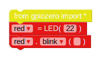
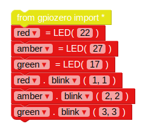

## Контролирайте светодиодите

1. Отворете EduBlocks от работния плот.

2. Кликнете върху **gpiozero** падащо меню, щракнете върху **Общи** и плъзнете `от внос на gpiozero *` блокирате в работното пространство.
    
    

3. Кликнете върху **Изходите** падащо меню под **gpiozero** и щракнете върху **LED**. Плъзнете `led = LED (ПИН)` блокирате в работното пространство под блока за импортиране. Преименувайте променливата от `led` до `червено`и промяна `ПИН` до `22`.

4. Плъзнете в `led.on` блокирайте и го поставете под предишния блок. Променете `на` падащо надолу до `мига`. Вашите кодови блокове трябва да изглеждат така:
    
    

5. Сега кликнете върху **Пусни** за да стартирате кода си. Трябва да видите червения светодиод мига.

6. Сега добавете още няколко LED блока, за да въведете другите две светлини и ги накарайте да мигат при различни скорости:
    
    

7. Изпълнете кода си отново и трябва да видите, че три светлини мигат с различни честоти.

8. Ако по-голям брой прави светлинното мигане по-бавно, колко число ще го направи по-бързо? Опитайте се да накарате лампите да мигат по-бързо.