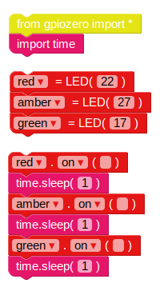

## Последователност на светофарите

1. `на` функцията ви позволява да включите светлината. Можете да използвате `sleep` за пауза между командите. Време за импортиране `123_7_1_321 | блок от <strong>Основно</strong> секция. Опитайте този пример, за да включите осветлението последователно:

Основните контроли за светодиодите са <code>на`, `изключени`, `превключващи` и `мигам`.

2. Опитайте да включите и изключите осветлението последователно:
    
    

3. Опитайте да повтаряте това, като поставите кода вътре в `докато` контур:
    
    

4. Сега знаете как да контролирате светлините поотделно и колко време можете да поставите на пауза между командите, можете ли да създадете последователност на светофарите? Последователността продължава:
    
    - Зелено на
    - Амбър на
    - Червено включено
    - Червено и кехлибарено
    - Зелено на

Важно е да мислите за времето. Колко време трябва да останат светлините на всеки етап?

След като приключите с последователността на светофара, може да опитате да добавите бутон и зумер, за да направите интерактивна светофара за пешеходна пътека.