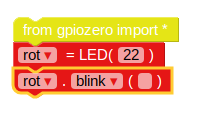
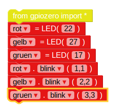

## Steuere die LEDs

--- task ---

Öffne EduBlocks vom Desktop aus.

--- /task ---

--- task ---

Klicke auf **gpiozero** im Dropdown-Menü, klicke auf **General** und ziehe den `from gpiozero import *` Block in den Arbeitsbereich.

--- /task ---

--- task ---

Klicke auf **Outputs** im Dropdown-Menü unter **gpiozero** und klicke auf **LED**. Ziehe einen `led = LED(pin)` Block in den Arbeitsbereich unter den Importblock. Die `led` Variable muss auf `rot` umgennant werden, und `pin` auf `22` geändert werden.

--- /task ---

--- task ---

Ziehe einen `led.on` Block hinein und docke ihn unter dem vorherigen Block an. Ändere das `on` mit dem Dropdown-Menü auf `blink`. Dein Code sollte jetzt so aussehen:

--- /task ---

--- task ---

Klicke nun auf **Run** in "menu" um den Code zu starten. Das rote LED müsste jetzt blinken.

--- /task ---

--- task ---

Füge nun weitere LED-Blöcke mit den anderen Lichtfarben hinzu, und lasse sie mit verschiedenen Geschwindigkeiten blinken:

--- /task ---

--- task ---

Führe deinen Code erneut aus und du sollten die drei Lichter mit unterschiedlichen Geschwindigkeiten blinken sehen.

--- /task ---

--- task ---

Wenn eine größere Zahl ein Licht langsamer blinken läßt, welche Zahl würde es schneller laufen lassen? Versuche, deine Lichter schneller blinken zu lassen.

--- /task ---