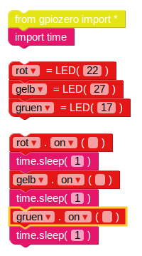
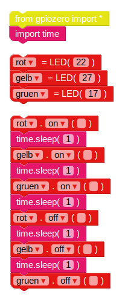
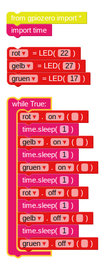

## Verkehrsampel Sequenz

\--- task \---

Die `on` Funktion ermöglicht es dir, ein Licht einzuschalten. Du kannst `sleep` verwenden, um das Programm anzuhalten. Füge den `Import time` Block aus dem **Basic** Bereich ein. Probiere dieses Beispiel aus, um die Lichter nacheinander einzuschalten:

Die Hauptbefehle für LEDs sind `on`, `off`, `toggle` und `blink` (ein-, aus- und umschalten, blinken).

\--- /task \---

\--- task \---

Versuche die Lichter der Reihe nach ein- und auszuschalten:

\--- /task \---

\--- task \---

Versuche dies zu wiederholen, indem du den Code in eine `while` Schleife einfügst:

\--- /task \---

\--- task \---

Jetzt weisst du, wie man die Lichter individuell steuert und die Pausen zwischen den Befehlen einstellt. Kannst du eine Ampelsequenz erstellen? Die Reihenfolge lautet:

- Grün ein
- Gelb an
- Rot an
- Rot und Gelb an
- Grün an

Es ist wichtig, über das Timing nachzudenken. Wie lange sollten die Lichter in jeder Phase eingeschaltet bleiben?

\--- /task \---

Wenn du die Ampelsequenz abgeschlossen hast, kannst du versuchen, eine Schaltfläche und einen Summer hinzuzufügen, um eine interaktive Ampel für einen Fußgängerübergang zu erstellen.