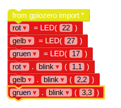

## Kontrolliere die LEDs

1. Öffne EduBlocks vom Desktop aus.

2. Klicken Sie auf **gpiozero** Drop-Down, klicken Sie auf **Allgemein** und ziehen Sie die `von gpiozero import *` In den Arbeitsbereich blocken.
    
    

3. Klicken Sie auf **Ausgaben** Drop-Down unter **gpiozero** und klicken Sie auf **LED**. Ziehen Sie eine `led = LED (pin)` Block in den Arbeitsbereich unter dem Importblock. Benennen Sie die Variable von `led` um zu `red`, und ändern `pin` zu `22`.

4. Ziehen Sie in einem `led.on` Blockieren und docken Sie es unter dem vorherigen Block an. Ändern Sie die `on` Drop-Down zu `blink`. Ihre Code-Blöcke sollten nun wie folgt aussehen:
    
    

5. Klicken Sie nun auf **Ausführen** um den Code zu starten. Sie sollten sehen, dass die rote LED blinkt.

6. Fügen Sie nun einige weitere LED-Blöcke hinzu, um die anderen zwei Lichter einzublenden und sie mit verschiedenen Geschwindigkeiten blinken zu lassen:
    
    

7. Führen Sie Ihren Code erneut aus und Sie sollten die drei Lichter mit unterschiedlichen Geschwindigkeiten blinken sehen.

8. Wenn eine größere Zahl ein Licht langsamer blinkt, welche Zahl würde es schneller laufen lassen? Versuche, deine Lichter schneller blinken zu lassen.