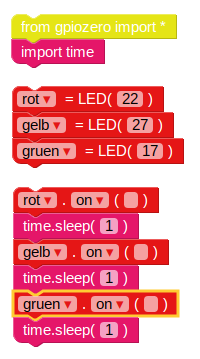
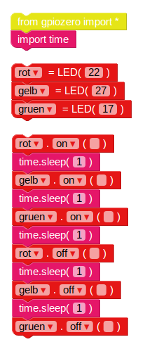
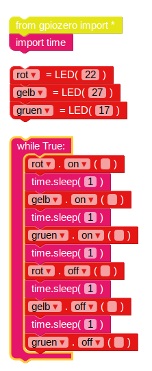

## Ampel Sequenz

1. Die `on` Funktion ermöglicht es Ihnen, ein Licht einzuschalten. Sie können `sleep` verwenden zwischen Befehlen anhalten. Bringe die `Importzeit` ein Blockieren von **Basic** Sektion. Probieren Sie dieses Beispiel aus, um die Lichter nacheinander einzuschalten:
    
    
    
    Die Hauptsteuerungen für LEDs sind `on`, `off`, `toggle` und `blink`.

2. Versuchen Sie, die Lichter der Reihe nach ein- und auszuschalten:
    
    

3. Versuchen Sie dies zu wiederholen, indem Sie den Code in ein `while` einfügen Schleife:
    
    

4. Jetzt wissen Sie, wie man die Lichter individuell steuert und die Pausen zwischen den Befehlen einstellt. Können Sie eine Ampelsequenz erstellen? Die Reihenfolge lautet:
    
    - Grün an
    - Bernstein an
    - Rot an
    - Rot und Bernstein an
    - Grün an

Es ist wichtig, über das Timing nachzudenken. Wie lange sollten die Lichter in jeder Phase eingeschaltet bleiben?

Wenn Sie die Ampelsequenz abgeschlossen haben, können Sie versuchen, eine Schaltfläche und einen Summer hinzuzufügen, um eine interaktive Ampel für einen Fußgängerübergang zu erstellen.