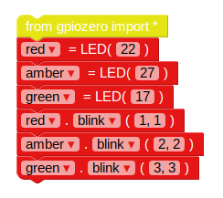

## Control the LEDs

1. Open EduBlocks from the Desktop.

2. Click the **gpiozero** drop-down, click **General** and drag the `from gpiozero import *` block into the workspace.
    
    

3. Click the **Outputs** drop-down under **gpiozero** and click **LED**. Drag an `led = LED(pin)` block into the workspace beneath the import block. Rename the variable from `led` to `red`, and change `pin` to `22`.

4. Drag in an `led.on` block, and dock it beneath the previous block. Change the `on` drop-down to `blink`. Your code blocks should now look like this:
    
    

5. Now click the **Run** button to run your code. You should see the red LED blink.

6. Now add some more LED blocks to introduce the other two lights, and make them blink at different speeds:
    
    

7. Run your code again and you should see the three lights flashing at different rates.

8. If a larger number makes a light blink slower, what number would make it run faster? Try to make your lights blink faster.