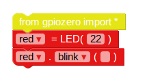

## کنترل LED ها

1. EduBlocks را از دسکتاپ باز کنید.

2. روی 123_8_0_321 | gpiozero</strong> کلیک کنید کشویی، کلیک کنید **عمومی** و از 12301_3_3_ | مسدود شدن به فضای کاری
    
    

3. روی **خروجی ها** کشویی زیر **gpiozero** و کلیک کنید **LED**. 123_6_0_321 | led = LED (پین) را بکشید</code> بلوک به فضای کاری زیر بلوک واردات. متغیر را از `led` تغییر نام دهید به `قرمز`و تغییر `پین` به `22`.

4. در یک `led.on` بلوک و آن را در زیر بلوک قبلی قرار دهید. تغییر `در` به 123 | اکنون بلوک های کد شما باید اینگونه باشد:
    
    

5. اکنون روی **اجرای** کلیک کنید دکمه برای اجرای کد شما. شما باید LED قرمز چشمک بزنید.

6. اکنون چند بلوک LED اضافه کنید تا دو چراغ دیگر را معرفی کنید و آنها را با سرعت های مختلفی متمرکز کنید:
    
    

7. دوباره کد خود را اجرا کنید و باید سه چراغ را با نرخ های مختلف ببینید.

8. اگر یک عدد بزرگتر باعث می شود که نور چشمک زدن کند، چه عدد آن را سریعتر اجرا می کند؟ سعی کنید که چراغ های خود را سریعتر روشن کنید.