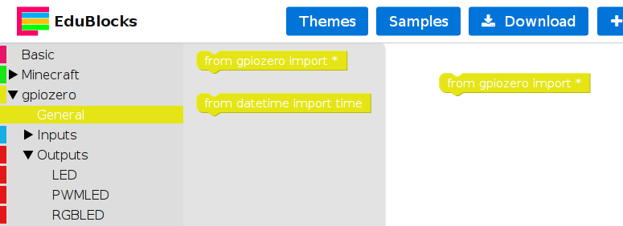
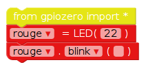
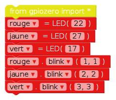

## Contrôlez les DELs

1. Lancez EduBlocks à partir du Bureau.

2. Cliquez le menu déroulant **gpiozero**, cliquez **General** et glissez le bloc `from gpiozero import *` dans l'espace de travail.
    
    

3. Cliquez le menu dérounalt **Outputs** sous **gpiozero** et cliquez sur **LED**. Glissez un bloc `led = LED(pin)` dans l'espace de travail sous le bloc import. Renommez la variable de `led` à `rouge` et changez `pin` pour `22`.

4. Glissez un bloc `led.on` et imbriquez le sous le bloc précédent. Changez la valeur du menu déroulant de `on` à `blink`. Votre code devrait maintenant avoir l'air de ceci:
    
    

5. Maintenant, cliquez sur le **Run** bouton pour exécuter votre code. Vous devriez voir la LED rouge clignoter.

6. Maintenant ajoutez quelques blocs de LED supplémentaires pour introduire les deux autres lumières, et les faire clignoter à des vitesses différentes:
    
    

7. Exécutez votre code à nouveau et vous devriez voir les trois lumières clignotant à des taux différents.

8. Si un plus grand nombre clignote plus lentement, quel nombre le ferait fonctionner plus vite? Essayez de faire clignoter vos lumières plus rapidement.