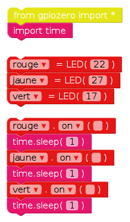
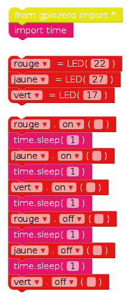
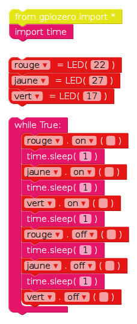

## Séquence de feux de circulation

1. Le `on` fonction vous permet d'allumer une lumière. Vous pouvez utiliser `sleep` pour faire une pause entre les commandes. Apportez le `temps d'importation` bloquer depuis le **Basic** section. Essayez cet exemple pour allumer les lumières en séquence:
    
    
    
    Les commandes principales des voyants sont les suivantes: `on`, `off`, `toggle` et `blink`.

2. Essayez d'allumer et d'éteindre les lumières dans l'ordre:
    
    

3. Essayez de répéter ceci en plaçant le code dans un `while` boucle:
    
    

4. Maintenant, vous savez comment contrôler les lumières individuellement, et le temps des pauses entre les commandes, pouvez-vous créer une séquence de feux de circulation? La séquence va:
    
    - Vert sur
    - Ambre sur
    - Rouge sur
    - Rouge et ambre sur
    - Vert sur

Il est important de penser au timing. Combien de temps les lumières doivent-elles rester allumées à chaque étape?

Une fois la séquence de feu de circulation terminée, vous pouvez essayer d'ajouter un bouton et un buzzer pour créer un feu de circulation interactif pour un passage pour piétons.