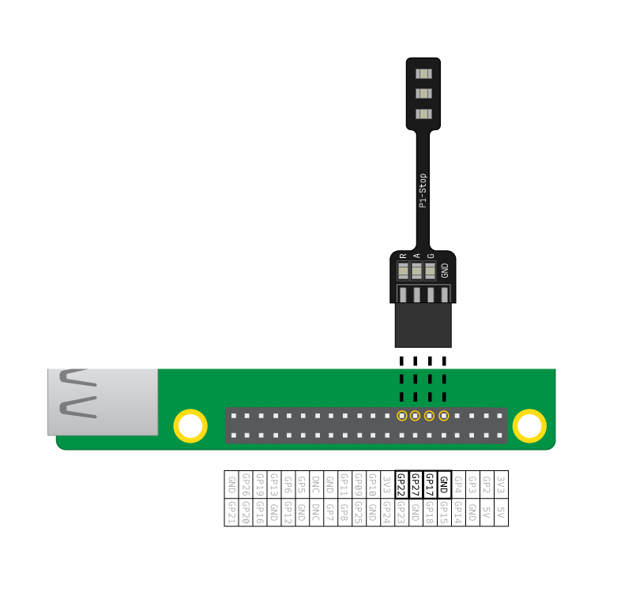

## एलईडी को जोडे

\--- task \---

अपने एल. ई. डी. को निम्नलिखित पिन से कनेक्ट करें:

| एल. ई. डी. | GPIO पिन |
| ---------- |:--------:|
| लाल        |    22    |
| पीला       |    27    |
| हरा        |    17    |

\--- /task \---