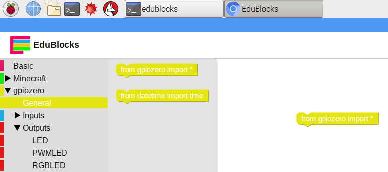

## एल.ई.डी. को नियंत्रित करें.

\--- task \---

डेस्कटॉप से ​​EduBlocks खोलें

\--- /task \---

\--- task \---

**gpiozero** ड्रॉप-डाउन पर क्लिक करें, **General** क्लिक करें और `from gpiozero import *` ब्लॉक को कार्यक्षेत्र में खींचें।

\--- /task \---

\--- task \---

**gpiozero** के नीचे **Outputs** ड्रॉप-डाउन पर क्लिक करें और **LED** क्लिक करें। `led = LED(pin)` ब्लॉक को कार्यक्षेत्र में खींचें और उपस्थित इम्पोर्ट ब्लॉक के नीचे रखे। `led` से `red` और `pin` से `22` नाम बदलें।

\--- /task \---

\--- task \---

`led.on` ब्लॉक को खींचें, और पिछले ब्लॉक के नीचे इसे डॉक करें। `on` ड्रॉप डाउन को `blink` में बदलें। आपका कोड ब्लॉक अब इस तरह दिखना चाहिए:

\--- /task \---

\--- task \---

अपना कोड चलाने के लिए अब **Run** बटन पर क्लिक करें। आपको लाल एल. ई. डी. लाइट जलती दिखेगी।

\--- /task \---

\--- task \---

अब अन्य दो एल. ई. डी. जलने के लिए कुछ और ब्लॉक्स जोड़े, और उन्हें विभिन्न गतियों पर ब्लिंक करें:

\--- /task \---

\--- task \---

अपना कोड फिर से चलाएं(Run करे) और आपको तीन एल. ई. डी. विभिन्न दरों पर चमकती दिखाई देनी चाहिए।

\--- /task \---

\--- task \---

अगर प्रोग्राममे बड़ी संख्या लेने से एलईडी की ब्लिंक धीमी हो जाती है, तो तेजी से ब्लिंक करने के लिए प्रोग्राममे कितने नंबर लेने चाहिए? अपनी एलईडी को तेजी से ब्लिंक कराने की कोशिश करें।

\--- /task \---