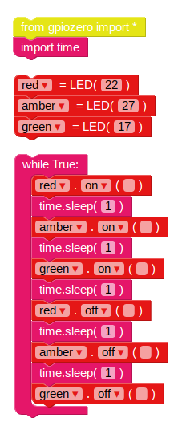

## ट्रैफिक लाइट अनुक्रम

1. `पर` फ़ंक्शन आप पर प्रकाश चालू करने की अनुमति देता है आप का उपयोग कर सकते हैं `नींद` आदेशों के बीच रोकें 123_6_0_321 | आयात समय में लाएं</code> 123_8_2_321 | बेसिक | 123_9_3_321 से ब्लॉक करें | अनुभाग। रोशनी को क्रम में चालू करने के लिए इस उदाहरण की कोशिश करें:
    
    
    
    एलईडी के लिए मुख्य नियंत्रण हैं 123_6_0_321 | पर</code>, `बंद`, `टॉगल` और `ब्लिंक`

2. रोशनी को अनुक्रम में चालू और बंद करने का प्रयास करें:
    
    

3. 123/6_0_321 | 123_7_1_321 के अंदर कोड डालकर इसे दोहराएं पाश:
    
    

4. अब आप जानते हैं कि रोशनी को अलग-अलग कैसे नियंत्रित किया जाए, और आदेशों के बीच का विराम के समय, क्या आप ट्रैफिक लाइट अनुक्रम बना सकते हैं? अनुक्रम चला जाता है:
    
    - ग्रीन पर
    - अंबर पर
    - रेड ऑन
    - लाल और एम्बर पर
    - ग्रीन पर

समय के बारे में सोचना महत्वपूर्ण है प्रत्येक चरण में रोशनी कितनी देर तक रहती है?

ट्रैफिक लाइट अनुक्रम पूरा करने के बाद, आप एक पैदल यात्री क्रॉसिंग के लिए इंटरैक्टिव ट्रैफिक लाइट बनाने के लिए बटन और बजर में जोड़ने का प्रयास करना चाह सकते हैं।