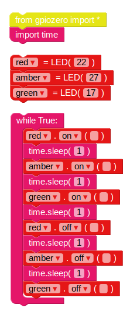

## A közlekedési lámpa sorrendje

1. A `on` funkció lehetővé teszi, hogy bekapcsoljon egy világítást. Használhatja a `sleep` -t szüneteltetni a parancsok között. Hozd a `importidőben` blokk a **Basic** szakasz. Próbálja meg ezt a példát a lámpák sorrendben történő bekapcsolásához:
    
    
    
    A LED-ek fő vezérlése: `on`, `off`, `váltás` és 123_6_6_321 | villog</code>.

2. Próbálja meg világítani és kikapcsolni a lámpákat:
    
    

3. Próbálja meg ezt ismételni úgy, hogy a kódot a `, míg` hurok:
    
    

4. Most már tudod, hogyan kell egyedileg irányítani a fényeket, és a parancsok közötti szünetek idejét, létrehozhatsz egy közlekedési lámpa sorozatát? A szekvencia megy:
    
    - Zölden
    - Borostyán
    - Piros
    - Piros és sárga
    - Zölden

Fontos időzni. Mennyi ideig kell a fények maradni minden szakaszban?

Miután befejezte a közlekedési lámpa sorozatát, érdemes megpróbálnia hozzáadni egy gombot és egy zümmögőt, hogy interaktív közlekedési lámpát készítsen egy gyalogos átkeléshez.