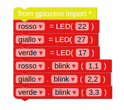

## Controlla i LED

\--- task \---

Lancia EduBlocks dalla Scrivania.

\--- /task \---

\--- task \---

Apri il menù **gpiozero**, seleziona **General** e trascina il blocco `from gpiozero import *` sullo spazio di lavoro.

\--- /task \---

\--- task \---

Click the **Outputs** drop-down under **gpiozero** and click **LED**. Drag an `led = LED(pin)` block into the workspace beneath the import block. Rename the variable from `led` to `red`, and change `pin` to `22`.

\--- /task \---

\--- task \---

Drag in an `led.on` block, and dock it beneath the previous block. Change the `on` drop-down to `blink`. Your code blocks should now look like this:

\--- /task \---

\--- task \---

Now click the **Run** button to run your code. You should see the red LED blink.

\--- /task \---

\--- task \---

Now add some more LED blocks to introduce the other two lights, and make them blink at different speeds:

\--- /task \---

\--- task \---

Run your code again and you should see the three lights flashing at different rates.

\--- /task \---

\--- task \---

If a larger number makes a light blink slower, what number would make it run faster? Try to make your lights blink faster.

\--- /task \---