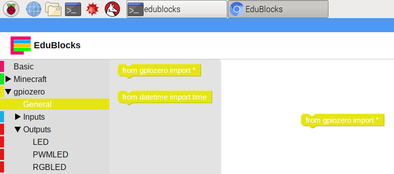
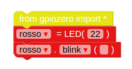
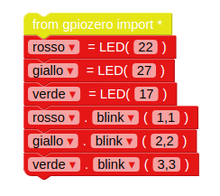

## Controlla i LED

1. Apri EduBlocks dal desktop.

2. Fai clic su **gpiozero** menu a discesa, fare clic su **Generale** e trascina il valore `dall'importazione di gpiozero *` bloccare nello spazio di lavoro.
    
    

3. Fare clic su **Uscite** menu a discesa sotto **gpiozero** e fare clic su **LED**. Trascinare un `led = LED (pin)` bloccare nello spazio di lavoro sotto il blocco di importazione. Rinominare la variabile da `led` a `red`, e modificare `pin` a `22`.

4. Trascina in un `led.on` blocco e collegarlo sotto il blocco precedente. Modificare il `on` menu a discesa a `lampeggio`. I blocchi di codice ora dovrebbero assomigliare a questo:
    
    

5. Ora fai clic su **Esegui** pulsante per eseguire il tuo codice. Dovresti vedere il LED rosso lampeggiare.

6. Ora aggiungi altri blocchi LED per introdurre le altre due luci e farle lampeggiare a velocità diverse:
    
    

7. Esegui nuovamente il codice e dovresti vedere le tre luci lampeggiare a velocità diverse.

8. Se un numero maggiore fa rallentare leggermente la luce, quale numero lo renderebbe più veloce? Prova a far lampeggiare più velocemente le tue luci.