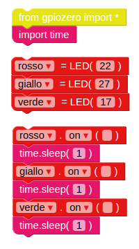
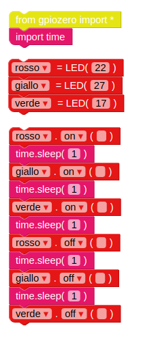
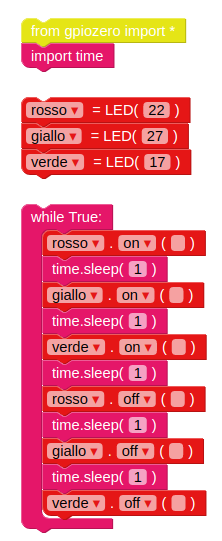

## Il semaforo

\--- task \---

La funzione `on` ti permette di accendere una luce. Puoi usare `sleep` per mettere in pausa tra i comandi. Trascina il blocco `import time`dalla sezione **Basic**. Prova questo esempio per accendere le luci in sequenza:

I controlli principali per i LED sono `on`, `off`, `toggle` e `blink`.

\--- /task \---

\--- task \---

Prova ad accendere e spegnere in sequenza le luci:

\--- /task \---

\--- task \---

Prova a ripetere questa sequenza inserendo il codice all'interno di un ciclo `while`:

\--- /task \---

\--- task \---

Adesso che sai come si controllano le luci individualmente, e come si mette una pausa fra un comando e l'altro, sei in grado di creare una sequenza come quella dei semafori? La sequenza è questa:

- Verde acceso
- Giallo acceso
- Rosso acceso
- Rosso e giallo accesi
- Verde acceso

È importante pensare alla tempistica. Per quanto tempo dovrebbero rimanere accese le luci in ogni fase?

\--- /task \---

Una volta completata la sequenza delle luci, potresti provare ad aggiungere un pulsante e un cicalino per creare un semaforo interattivo che preveda l'attraversamento pedonale.