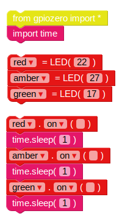

## Sequenza dei semafori

1. Il `on` la funzione ti permette di accendere una luce. È possibile utilizzare `sleep` per mettere in pausa tra i comandi. Inserisci il `tempo di importazione` blocco da **Basic** sezione. Prova questo esempio per accendere le luci in sequenza:
    
    
    
    I controlli principali per i LED sono `on`, `off`, `toggle` e `lampeggia`.

2. Prova ad accendere e spegnere le luci in sequenza:
    
    

3. Prova a ripetere questo inserendo il codice all'interno di `while` ciclo continuo:
    
    

4. Ora sai come controllare le luci individualmente e cronometrare le pause tra i comandi, puoi creare una sequenza di semafori? La sequenza va:
    
    - Verde acceso
    - Ambra
    - Rosso acceso
    - Rosso e ambra
    - Verde acceso

È importante pensare ai tempi. Per quanto tempo dovrebbero rimanere accese le luci in ogni fase?

Una volta completata la sequenza del semaforo, potresti provare ad aggiungere un pulsante e un cicalino per creare un semaforo interattivo per un passaggio pedonale.