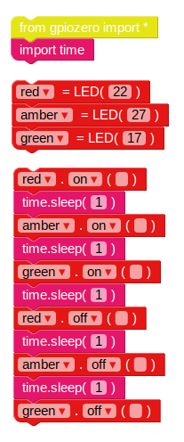

## 交通信号のシーケンス

1. `on`機能でライトを点灯させることができます。 あなたは`sleep`を使うことができます。コマンド間で一時停止する。 `インポート時間` **基本**からブロックセクション。 次の例を試して、ライトを順番にオンにします。
    
    
    
    LEDのメインコントロールは、`on`、`off`、`toggle` `点滅`となります。

2. 順番にライトをオンまたはオフにしてみてください：
    
    

3. `の中にコードを入れてこれを繰り返す`ループ：
    
    

4. 今度は、ライトを個別に制御する方法を知り、コマンド間の休止時間を計る、信号灯シーケンスを作成することができますか？ シーケンスは次のようになります。
    
    - グリーンオン
    - アンバーオン
    - レッドオン
    - 赤と琥珀色
    - グリーンオン

タイミングについて考えることが重要です。 各ステージでどれくらいの間ライトが点灯し続けるのですか？

信号灯のシーケンスが完了したら、ボタンとブザーを追加して、歩行者の交差点に対話的な信号を発することができます。