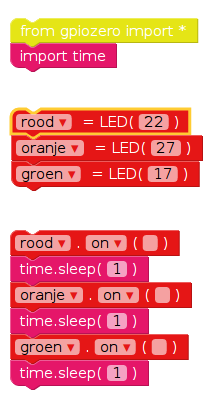
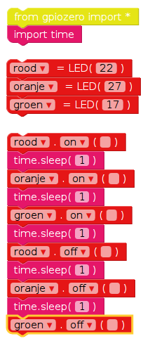
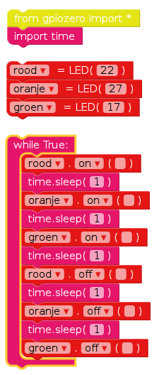

## Verkeerslichten volgorde

--- task ---

Met de `on` functie kan je een licht aanschakelen. Je kunt `sleep` gebruiken om te pauzeren tussen opdrachten. Sleep een `import time` blok uit de **Basic** sectie in het venster. Probeer dit voorbeeld eens om de lichten achter elkaar in te schakelen:

De belangrijkste bedieningselementen voor LED's zijn `on` aan, `off` uit, `toggle` wissel en `blink` knipperen.

--- /task ---

--- task ---

Probeer de lichten achter elkaar in en uit te schakelen:

--- /task ---

--- task ---

Probeer dit te herhalen door de code in een `while` lus te zetten:

--- /task ---

--- task ---

Nu weet je hoe je de lichten en de pauzes tussen opdrachten afzonderlijk kunt besturen, kun je nu een goede volgorde en tijdsduur voor een verkeerslicht maken? De volgorde is:

- Rood uit, groen aan
- Groen uit, oranje aan
- Oranje uit, rood aan
- Rood en oranje aan
- Groen aan

Het is belangrijk om na te denken over de tijdsduur van elk licht. Hoe lang moet het licht in elke fase aan blijven?

--- /task ---

Nadat je de volgorde van het verkeerslicht hebt voltooid, kunt je proberen een knop en een zoemer toe te voegen om een ​​interactief verkeerslicht te maken voor een zebrapad.

**Door de community geleverde vertaling**

Dit project werd vertaald door **Robert-Jan Kempenaar** en gecontroleerd door **Coen Warries**.

Onze geweldige vertalers helpen ons om kinderen over de hele wereld de kans te geven te leren coderen. Jij kunt ons helpen nog meer kinderen te bereiken door onze projecten te vertalen - lees meer op [rpf.io/translators](https://rpf.io/translators).