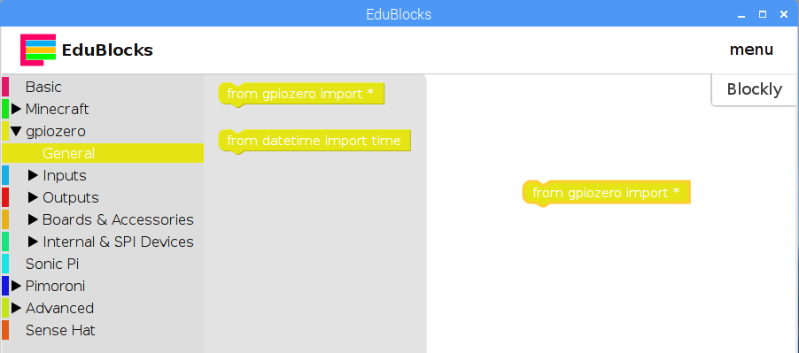
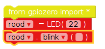
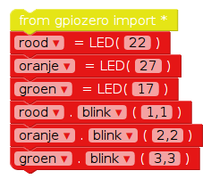

## Bedien de LED's

1. Open EduBlocks vanaf het bureaublad.

2. Klik op de **gpiozero** drop-down, klik **Algemeen** en sleep de `from gpiozero import *` blokkeren in de werkruimte.
    
    

3. Klik op de **Uitvoer** drop-down onder **gpiozero** en klik op **LED**. Sleep een `led = LED (pin)` blokkeren in de werkruimte onder het importblok. Hernoem de variabele van `led` naar `red`, and change `pin` naar `22`.

4. Sleep in een `led.on` blokkeren en plaats het onder het vorige blok. Verander de `on` drop-down naar `knipperen`. Uw codeblokken moeten er nu als volgt uitzien:
    
    

5. Klik nu op de **Uitvoeren** knop om uw code uit te voeren. Je zou de rode LED moeten zien knipperen.

6. Voeg nu nog meer LED-blokken toe om de andere twee lampen te introduceren en laat ze op verschillende snelheden knipperen:
    
    

7. Voer uw code opnieuw uit en u zou de drie lampjes met verschillende snelheden moeten zien knipperen.

8. Als een groter getal het lampje langzamer laat knipperen, welk cijfer zou het dan sneller laten werken? Probeer je lichten sneller te laten knipperen.