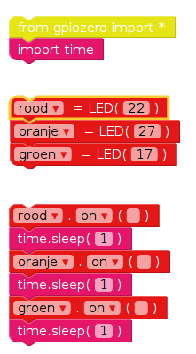
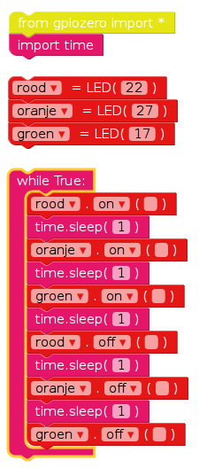

## Volgorde verkeerslichten

1. De `on` functie stelt u in staat een licht aan te doen. U kunt `sleep` gebruiken om te pauzeren tussen opdrachten. Breng de `import tijd` binnen blokkeren van de **Basis** sectie. Probeer dit voorbeeld om de lichten achter elkaar in te schakelen:
    
    
    
    De belangrijkste bedieningselementen voor LED's zijn `on`, `uit`, `toggle` en `knipperen`.

2. Probeer de lichten achter elkaar in en uit te schakelen:
    
    

3. Probeer dit te herhalen door de code in een `while` lus:
    
    

4. Nu weet u hoe u de lichten afzonderlijk bedient en de pauzes tussen opdrachten kunt u een opeenvolging van verkeerslichten maken? De volgorde gaat:
    
    - Groen aan
    - Amber aan
    - Rood aan
    - Rood en oranje op
    - Groen aan

Het is belangrijk om na te denken over timing. Hoe lang moet het licht aan blijven in elke fase?

Nadat u de volgorde van het verkeerslicht hebt voltooid, kunt u proberen een knop en een zoemer toe te voegen om een ​​interactief verkeerslicht te maken voor een zebrapad.